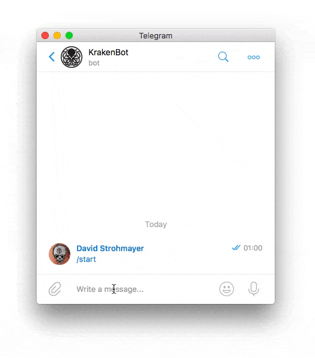

# Telegram Kraken Bot
Python 3 bot to trade on [Kraken](https://www.kraken.com) via [Telegram messenger](https://telegram.org)

<p align="center">
  
</p>

## Overview
This Python script is a polling (not [webhook](https://github.com/python-telegram-bot/python-telegram-bot/wiki/Webhooks)) based Telegram bot. It can trade crypto-currencies on the [Kraken](http://kraken.com) marketplace and has a user friendly interface (custom keyboards with buttons).

### Features
- Bound to a specific Telegram user - only that user can use the bot
- No need to login to Kraken - start trading immediately, always
- Integrated update mechanism - get latest version from GitHub
- Notifies you once order is closed and trade successfully executed
- Fully usable with buttons - no need to enter commands manually
- Supports all currencies available on Kraken (configurable)
- Change bot settings via bot
- Following Kraken functionality is implemented
    - Create a buy / sell order (type _limit_ or _market_)
    - Lookup last trade price for currencies
    - Show all your assets
    - Current market value of assets (one or all)
    - Show / close open orders
    - Sell all assets for current market price
    - Deposit & withdraw
    - Show real-time charts
    - List history of closed orders
    - Check state of Kraken API

## Files
In the following list you will find detailed information all the files that the project consists of - and if they are necessary to run the bot or not.

- __.gitignore__: Only relevant if you use [git](https://git-scm.com) as your Source Code Management. If you put a filename in that file, then that file will not be commited to the repository. If you don't intend to code yourself, the file is _not needed_.
- __\_config.yml__: Automatically genereated file from GitHub that holds the theme-name for the [project page](https://endogen.github.io/Telegram-Kraken-Bot). This file is _not needed_.
- __config.json__: The configuration file for this bot. This file is _needed_.
- __demo.gif__: Animated image for GitHub `README.md` to demonstrate how the bot looks and behaves. This file is _not needed_.
- __kraken.key__: The content of this file has to remain secret! _Do not tell anybody anything about the content_. The file consists of two lines. First line: API key. Second line: API secret (you get both from Kraken). This file is _needed_.
- __Procfile__: This file is only necessary if you want to host the bot on [Heroku](https://www.heroku.com). Otherwise, this file is _not needed_.
- __README.md__: The readme file you are reading right now. Includes instructions on how to run and use the bot. The file is _not needed_.
- __requirements.txt__: This file holds all dependencies (Python modules) that are required to run the bot. Once all dependencies are installed, the file is _not needed_ anymore. If you need to know how to install the dependencies from this file, take a look at the [dependencies](#dependencies) section.
- __telegram\_python\_bot.py__: The bot itself. This file has to be executed with Python to run. For more details, see the [installation](#installation) section. This file is _needed_.

#### Summary
These are the files that are important to run the bot:

- `kraken.key` (API Secret)
- `config.json` (Configuration)
- `telegram_kraken_bot.py` (Bot itself)

## Configuration
Before starting up the bot you have to take care of some settings. You need to edit two files:

### config.json
This file holds the configuration for your bot. You have to at least edit the values for __user_id__ and __bot_token__. After a value has been changed you have to restart the bot for the applied changes to take effect.

- __user_id__: Your Telegram user ID. The bot will only reply to messages from this user. If you don't know your user ID, send a message to Telegram bot `userinfobot` and he will reply your ID (use the ID, not the username)
- __bot_token__: The token that identifies your bot. You will get this from Telegram bot `BotFather` when you create your bot. If you don't know how to register your bot, follow these [instructions](https://core.telegram.org/bots#3-how-do-i-create-a-bot)
- __base_currency__: Command `/value` will use the base currency and show you the current value in this currency. If you want to get the value of all your assets, this only works if all your assets can be traded to this currency. You can enter here any asset: `EUR`, `USD`, `XBT`, `ETH`, ...
- __check_trade__: Time in seconds to check for order status changes. Value `0` disables the check. Every order (already existing or newly created - not only by this bot) will be monitored by a background job and if the status changes to `closed` (which means that a trade was successfully executed) you will be notified by a message.
- __update_url__: URL to the latest GitHub version of the script. This is needed for the update functionality. Per default this points to my repository and if you don't have your own repo with some changes then you should use the default value
- __update_hash__: Hash of the latest version of the script. __Please don't change this__. Will be set automatically after updating. There is not need to play around with this
- __update_check__: Time in seconds to check for bot-updates. Value `0` disables the check. If there is a bot-update available you will be notified by a message
- __send_error__: If `true`, then all errors that happen will trigger a message to the user. If `false`, only the important errors will be send and timeout errors of background jobs will not be send
- __show\_access\_denied__: If `true`, the owner of the bot and any other user who tries to access the bot will both be notified. If `false`, no one will be notified. Set to `false` if you get spammed with `Access denied` messages from people that try to use your bot
- __used_pairs__: List of pairs to use with the bot. You can choose from all available pairs at Kraken: `"XBT": "EUR"`, `"ETH": "EUR"`, `"XLM": "XBT"`, ...
- __coin_charts__: Dictionary of all available currencies with their corresponding chart URLs. Feel free to add new ones or change the ones that are pre-configured if you like to use other charts
- __log_level__: Value has to be an __integer__. Choose the log-level depending on this: `0` = Disabled, `10` = DEBUG, `20` = INFO, `30` = WARNING, `40` = ERROR, `50` = CRITICAL
- __log\_to\_file__: Debug-output that usually goes to the console will be saved  in folder `log` in a log-file. Only enable this if you're searching for a bug because the logfiles can get pretty big.
- __history_items__: Number of executed trades to display simultaneously
- __retries__: If bigger then `0`, then Kraken API calls will be retried the specified number of times if they return any kind of error. In most cases this is very helpful since at the second or third time the request will most likely make it through
- __single_price__: If `true`, no need to choose a coin in `/price` command. Only one message will be send with current prices for all coins that are configured in setting `used_pairs`
- __single_chart__: If `true`, no need to choose a coin in `/chart` command. Only one message will be send with links to all coins that are configured in setting `used_pairs`
- __decimals__: Number of decimal places that will be displayed. If you don't want to see small amounts in `/balance`, set this to `6` or smaller. If you use `8`, which is the maximum value and the one that Kraken uses internally, and you experience errors (while buying with volume `ALL` you could get an `Insufficient funds` error) set it to `7` or smaller
- __webhook_enabled__: _Not used yet_
- __webhook_listen__: _Not used yet_
- __webhook_port__: _Not used yet_
- __webhook_key__: _Not used yet_
- __webhook_cert__: _Not used yet_
- __webhook_url__: _Not used yet_

### kraken.key
This file holds two keys that are necessary in order to communicate with Kraken. Both keys have to be considered __secret__ and you should be the only one that knows them.

<a name="api-keys"></a>
If you don't know where to get or how to generate the keys:

1. Login to [Kraken](https://www.kraken.com)
2. Click on `Settings`
3. Click on `API`
4. Click on `Generate New Key`
5. Enter `Telegram-Kraken-Bot` in `Key Description`
6. Enter `4` in `Nonce Window` (or just use the default value)
7. Select all available permissions at `Key Permissions`
8. Click on `Generate Key`

When you have your Kraken API keys, open the file `kraken.key` and replace `some_api_key` (first line) with the value of `API Key` and `some_private_key` (second line) with the value of `Private Key`.

<a name="installation"></a>
## Installation
In order to run the bot you need to execute the script `telegram_kraken_bot.py`. If you don't have any idea where to host it, take a look at [Where to host Telegram Bots](https://github.com/python-telegram-bot/python-telegram-bot/wiki/Where-to-host-Telegram-Bots). __Since you have to provide sensitive data (Kraken API keys) to use the bot, i would only host this script on a server that you own__. But services like [Heroku](https://www.heroku.com) should be save too. You can also run the script locally on your computer for testing purposes.

### Prerequisites
##### Python version
You have to use __Python 3.6__ to execute the script (because of enum method `auto()`). If you would like to use Python 3.4 or 3.5, you have to remove `auto` from imports and set the values in `WorkflowEnum` and `KeyboardEnum` yourself. Python 2.x is __not__ supported.

<a name="dependencies"></a>
##### Installing needed modules from `requirements.txt`
Install a set of module-versions that is known to work together for sure (__highly recommended__):
```shell
pip3.6 install -r requirements.txt
```

##### Install newest versions of needed modules
If you want to install the newest versions of the needed modules, execute the following:
```shell
pip3.6 install python-telegram-bot -U
pip3.6 install beautifulsoup4 -U
pip3.6 install krakenex -U
```

### Starting
To start the script, execute
```shell
python3.6 telegram_kraken_bot.py &
```

### Stopping
To stop the script, execute
```shell
pkill python
```

which will kill __every__ Python process that is currently running. Or shut the bot down with the `/shutdown` command (__recommended__).

## Usage
If you configured the bot correctly and execute the script, you should see some checks that the bot performs. After that a welcome message will be shown along with the information if you are using the latest version. There should also be a custom keyboard that shows you all the available commands. Click on a button to execute the command or type the command in manually (not case sensitive).

:warning: In general, while entering the volume, make sure that you don't use smaller values then Kraken supports. Take a look at the [order limits for various coins](https://support.kraken.com/hc/en-us/articles/205893708-What-is-the-minimum-order-size-). If you do use smaller values, the bot will tell you it's not possible to use that value and will let you enter the volume again.

### Available commands
##### Related to Kraken
- `/trade`: Create a new buy or sell order of type `limit` or `market`
- `/orders`: Show all open orders (buy and sell) and close a specific one or all
- `/balance`: Show all assets with the available volume (if open orders exist)
- `/price`: Return last trade price for the selected crypto-currency
- `/value`: Show current market value of chosen currency or all your assets
- `/chart`: Show a trading chart for the chosen currency
- `/history`: Show history of closed (executed) trades
- `/funding`: Deposit or withdraw (only to wallet, not SEPA) funds
- `/state`: Show performance state of Kraken API

##### Related to bot
- `/update`: Update the bot to the latest version on GitHub
- `/restart`: Restart the bot
- `/shutdown`: Shutdown the bot
- `/settings`: Show and change bot settings
- `/reload`: Reload custom command keyboard
- `/initialize`: Perform initialization (precondition for start)

If you want to show a list of available commands as you type, open a chat with Telegram user `BotFather` and send the command `/setcommands`. Then choose the bot you want to activate the list for and after that send the list of commands with description. Something like this:
```
trade - buy or sell assets
orders - show or close orders
balance - show all your assets
price - show current price for asset
value - calculate value for assets
chart - display trading charts
history - show completed trades
funding - deposit or withdraw currencies
bot - update, restart or shutdown
```

## Development
I know that it is unusual to have the whole source code in just one file. At some point i should have been switching to object orientation and multiple files but i kind of like the idea to have it all in just one file and object orientation would only blow up the code. This also makes the `/update` command much simpler :)

### Todo
##### Priority 1
- [x] Add command `/history` that shows executed trades
- [x] Add command `/chart` to show TradingView Chart Widget website
- [x] Add command `/funding` to deposit / withdraw funds
- [ ] Add command `/alert` to be notified once a specified price is reached
- [x] Enable to trade every currency that Kraken supports
- [x] Add possibility to change settings via bot
- [x] Sanity check on start for configuration file
- [x] Add possibility to sell __all__ assets immediately to current market value
- [x] Per asset: Sell to current market price

##### Priority 2
- [x] Optimize code to call Kraken API less often
- [x] Automatically check for updates (with configurable timespan)
- [ ] Create webhook-version of this bot
- [x] Log to file (every day a new logfile)
- [ ] Option: Only one open buy or sell order per asset
- [ ] Periodically send current market price of a coin
- [ ] Backup (settings & bot) on update
- [ ] Show trends per asset in `/price` command
- [ ] Point updates to GitHub releases with change logs
- [ ] Option: Backup on update

##### Priority 3
- [ ] Internationalisation
- [ ] Add command `/stats` that shows statistics
- [ ] Closed order notifications: Show gain / loss if association between trades possible

## Troubleshooting
In case you experience any issues, please take a look at this section to check if it is described here. If not, create an [issue on GitHub](https://github.com/Endogen/Telegram-Kraken-Bot/issues/new).

:warning: It depends on the error but it is possible that a request to Kraken will return with an error and still be executed correctly.

:warning: If it happens that a specific command doesn't trigger any action (no response from the bot on button click), try to reload the keyboard with `/reload` or if that doesn't help, restart the bot with `/restart`.

- __Error `Invalid nonce`__: It might happen that Kraken replies with this error. If you want to understand what a nonce is, read the [Wikipedia article](https://en.wikipedia.org/wiki/Cryptographic_nonce). This error happens mostly if you use different Telegram clients. Maybe you issued some commands on your laptop and then switched to your smartphone? That would be a typical scenario where this might happen. Or you didn't use the bot for a long time. To resolve it, just execute the command again. It should work the second time. Unfortunately there is not much i can do. The correct behavior would be to have one Kraken API key-pair for one device (one for your smartphone and one for your laptop). Unfortunately there is no way to identify the client. You can play around with the nonce value in your Kraken account (take a look at the [settings for the generated key-pair](#api-keys)). If you are really annoyed by this then here is what you could try: Create some key-pairs (5 might do it) and then, before you call the Kraken API, randomly choose one of the keys and use it till the next Kraken API call is made.
- __Error `Service unavailable`__: If you get this error then because Kraken fucked up again. That happens regularly. It means that their API servers are not available or the performance is degraded because the load on the servers is too high. Nothing you can do here - try again later. If you want to have details on the API server performance, go to [Kraken Status](https://status.kraken.com) or execute the `/state` command.

## Disclaimer
I use this bot personally to trade on Kraken so i guess it's kind of stable but __if you use it, then you are doing this on your own responsibility__ !!! I can not be made responsible for lost coins or other stuff that might happen due to some fuckup within the code. Use at your own risk!

## Donating
If you find __Telegram-Kraken-Bot__ suitable for your needs or maybe even made some money because of it, please consider donating whatever amount you like to:

#### Monero (XMR)
```
46tUdg4LnqSKroZBR1hnQ2K6NnmPyrYjC8UBLhHiKYufCipQUaACfxcBeQUmYGFvqCdU3ghCpYq2o5Aqyj1nH6mfLVNka26
```

#### Ethereum (ETH)
```
0xccb2fa97f47f0d58558d878f359013fef4097937
```

#### How else can you support me?
If you can't or don't want to donate, please consider signing up on listed exchanges below. They are really good and by using these links to register an account i get a share of the trading-fee that you pay to the exchange if you execute a trade.

- [Binance](https://www.binance.com/?ref=16770868)
- [KuCoin](https://www.kucoin.com/#/?r=H3QdJJ)
- [Qryptos](https://accounts.qryptos.com/sign-up?affiliate=wVZoZ4uG269520)
